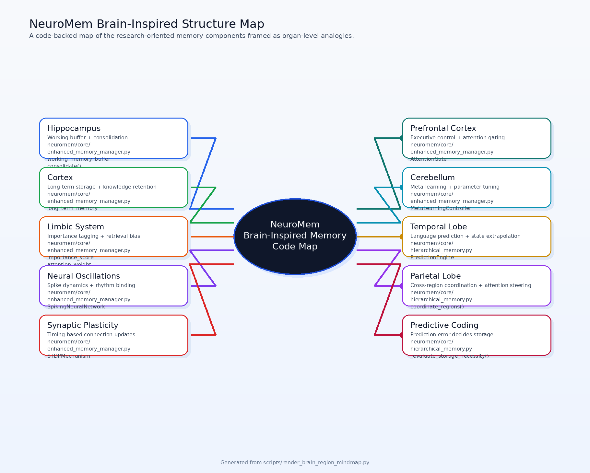
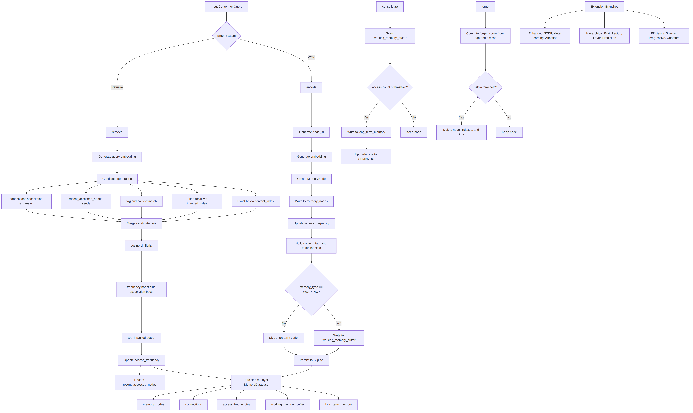
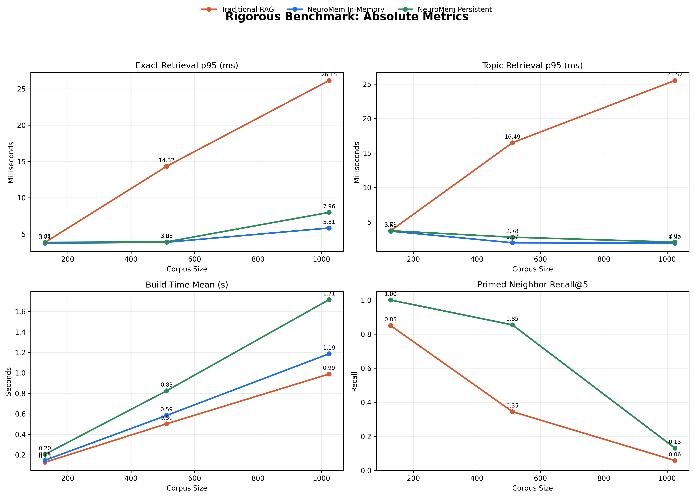
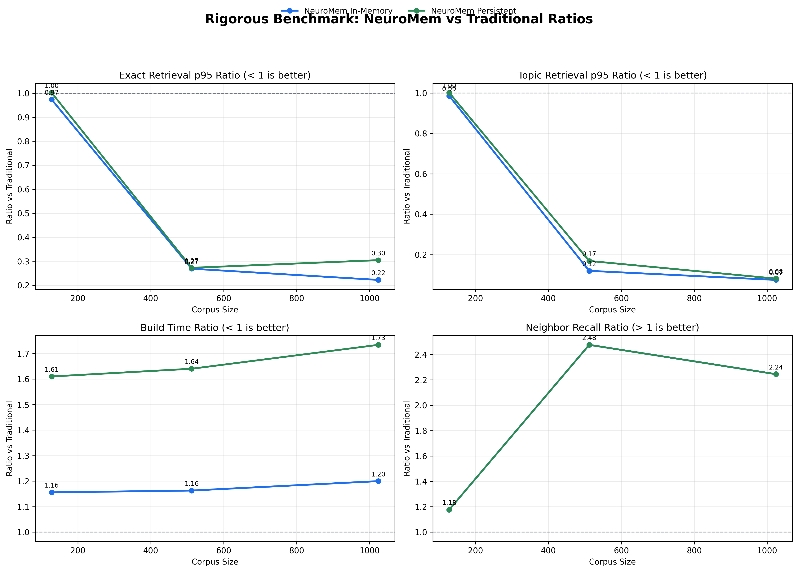
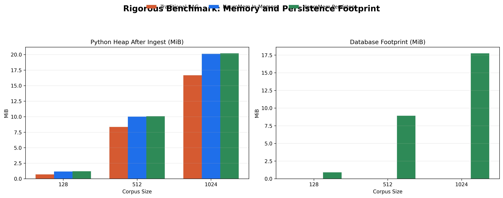
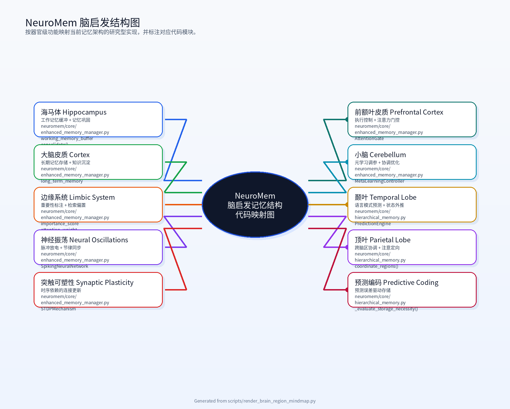
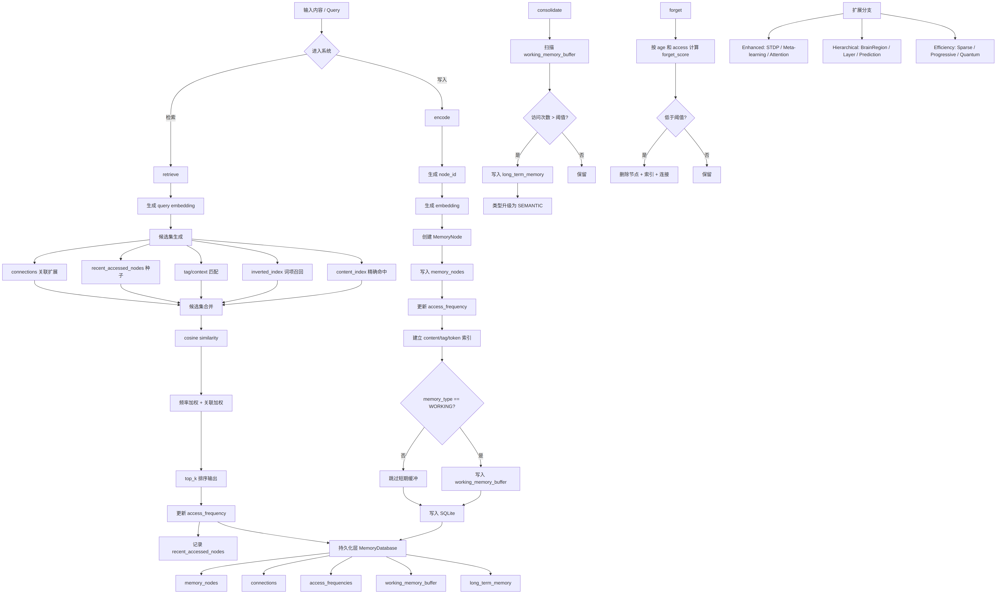

# NeuroMem-Agents: Neuromorphic Memory Management System

[](https://www.gnu.org/licenses/gpl-3.0)
[](https://www.python.org/downloads/)

A developer-focused memory layer for AI agents that adds session-scoped recall, associative retrieval, and long-context continuity to existing tools with minimal client changes.

NeuroMem is not a new LLM. It is a memory middleware layer that sits between your client and an upstream model.
It retrieves session-scoped memories, injects them as structured context, stores the new turn, and returns the upstream model's answer.
Use it when long conversations, large projects, or agent handoffs are starting to break under flat chat history or basic RAG.

## Why Developers Use It

- **Scoped long-term memory**: keep recall inside the current session or project instead of leaking across unrelated work.
- **Agent-oriented retrieval**: combine typed memory nodes, associative links, and lifecycle management rather than only vector similarity.
- **Low-friction integration**: connect through an OpenAI-compatible proxy, MCP, LangChain, or LlamaIndex with minimal client changes.

Brain-inspired subsystem map:



This diagram maps the organ-level analogy layer to the current implementation modules. [Mermaid source](docs/neuromem_brain_regions_mindmap_en.md) and [generator](scripts/render_brain_region_mindmap.py).

System architecture at a glance:



## Memory Structure and Mechanisms

NeuroMem is not just a vector store behind a chat API. Its memory model combines session isolation, typed memory nodes, associative links, and lifecycle management so an agent can keep continuity in long conversations and large projects without treating all history as one flat context pool.

- **Session-scoped isolation**: the integration layer tags each record with a session or project scope by default, so retrieval stays inside the current task instead of leaking across unrelated work.
- **Typed memory nodes**: memories can be stored as `working`, `episodic`, `semantic`, or `sensory`, which lets the system separate temporary context from reusable knowledge.
- **Associative graph recall**: memories are not only matched by query similarity; they can also be linked to each other, and those links can expand the retrieval set during later queries.
- **Candidate-pruned retrieval**: the main memory manager combines exact matches, inverted-index term recall, tag filters, recent activation seeds, and association expansion before final ranking, which improves efficiency under larger memory sets.
- **Memory lifecycle management**: high-frequency working memories can be consolidated into long-term memory, while stale low-value nodes can be decayed and forgotten to keep the store useful instead of just growing forever.
- **Research extensions remain available**: the core module also includes attention gating, STDP-style plasticity, predictive coding, and multi-region coordination for experiments on more brain-inspired memory control.

In practice, the OpenAI-compatible proxy, MCP server, and framework adapters expose the stable session-scoped associative layer first, while the more biologically inspired managers remain available as opt-in research components.

## Integration Compatibility

- **Upstream chat providers**: OpenAI, Anthropic, Gemini, Ollama, LM Studio, and vLLM
- **Client compatibility**: Python and JavaScript projects that already use an OpenAI-compatible `base_url`
- **MCP compatibility**: local `stdio` and remote `streamable-http` transports for IDE agents and MCP runtimes
- **Framework compatibility**: first-party LangChain and LlamaIndex adapters with OpenAI-compatible chat helpers
- **IDE compatibility**: ready-to-use VS Code and JetBrains MCP config packs in `examples/ide/*`
- **Deployment compatibility**: Docker image and `docker compose` / `docker-compose` template for one-command startup
- **API surface**: `/v1/chat/completions`, `/v1/responses`, `/v1/memory/records`, `/v1/memory/search`, `/v1/memory/stats`
- **Observability**: JSON and Prometheus metrics endpoints for retrieval and request behavior
- **Configuration model**: provider-agnostic JSON config with environment variable overrides
- **Examples**: `examples/configs/*.example.json`, `examples/compatibility/*`, and `examples/ide/*`
- **MCP docs**: `docs/mcp_integration.md`
- **LangChain docs**: `docs/langchain_integration.md`
- **LlamaIndex docs**: `docs/llamaindex_integration.md`
- **Docker docs**: `docs/docker_deployment.md`
- **Release notes**: `CHANGELOG.md`
- **Roadmap**: `docs/compatibility_roadmap.md`

## Release 0.3.0

- OpenAI-compatible proxy, MCP server, LangChain, and LlamaIndex are now shipped as one coherent developer surface.
- Built-in metrics, direct memory APIs, and ready-to-use VS Code / JetBrains MCP configs reduce setup friction.
- Docker deployment, rigorous benchmark artifacts, and visualization outputs are included in the repository.
- The project is now released under GNU GPL v3.

## Start Here

- Existing OpenAI-compatible app: point its `base_url` at the NeuroMem proxy.
- IDE or agent runtime: connect to the MCP server with `stdio` or `streamable-http`.
- LangChain or LlamaIndex stack: use the first-party retriever helpers in `neuromem.frameworks`.
- Local-first deployment: keep `embedding_model.provider = local_lexical` and share one SQLite `db_path`.

## Research Direction

- Session-scoped memory prevents cross-project leakage in long conversations and large project contexts.
- Associative retrieval and automatic linking aim to surface related decisions, code context, and handoff details.
- Hierarchical and biologically inspired memory managers remain available in the core module for research workflows.
- Benchmarks, charts, and deeper architectural notes remain in this README and `benchmark_results/`.

## 🚀 Quick Start

### Installation

```bash
pip install neuromem-agents
# or install the OpenAI-compatible proxy server
pip install 'neuromem-agents[server]'
# or install the MCP server
pip install 'neuromem-agents[mcp]'
# or install the LangChain adapter
pip install 'neuromem-agents[langchain]'
# or install the LlamaIndex adapter
pip install 'neuromem-agents[llamaindex]'
```

### OpenAI-Compatible Proxy

Start from one of the example configs:

```bash
cp examples/configs/openai_proxy.example.json ./neuromem.proxy.json
export OPENAI_API_KEY=your_key_here
neuromem-openai-server --config ./neuromem.proxy.json
```

Then point any OpenAI-compatible client to the local proxy:

```bash
curl http://127.0.0.1:8080/v1/chat/completions \
  -H "Content-Type: application/json" \
  -H "Authorization: Bearer neuromem-local" \
  -d '{
    "model": "your-upstream-model",
    "messages": [
      {"role": "user", "content": "What did we decide about the retrieval pipeline?"}
    ],
    "neuromem": {
      "session_id": "demo-project",
      "top_k": 5,
      "store_messages": true
    }
  }'
```

You can also write or inspect memory directly:

```bash
curl http://127.0.0.1:8080/v1/memory/search \
  -H "Content-Type: application/json" \
  -d '{
    "query": "retrieval pipeline",
    "session_id": "demo-project",
    "top_k": 5
  }'
```

For SDK examples, see:

- `examples/compatibility/openai_sdk_client.py`
- `examples/compatibility/openai_sdk_responses_client.py`
- `examples/compatibility/openai_client.js`

### MCP Server

NeuroMem also ships with a first-party MCP server for IDE agents and MCP-capable runtimes.

Start a local `stdio` MCP server:

```bash
neuromem-mcp-server \
  --config examples/configs/mcp_stdio.example.json \
  --transport stdio
```

Start a remote `streamable-http` MCP server:

```bash
neuromem-mcp-server \
  --config examples/configs/mcp_streamable_http.example.json \
  --transport streamable-http \
  --host 127.0.0.1 \
  --port 8765
```

The default MCP HTTP endpoint is `http://127.0.0.1:8765/mcp`.

What it exposes:

- Tools: `create_memory`, `search_memory`, `list_memories`, `associate_memories`, `get_memory_stats`, `get_observability_metrics`, `consolidate_memory`
- Resources: `memory://stats/overview`, `memory://stats/observability`, `memory://sessions/{session_id}/summary`, `memory://records/{memory_id}`
- Prompts: `memory_recall_query`, `project_handoff_brief`

Ready-to-use client config packs:

- `examples/ide/vscode/mcp_stdio.example.json`
- `examples/ide/vscode/mcp_streamable_http.example.json`
- `examples/ide/jetbrains/mcp_stdio.example.json`
- `examples/ide/jetbrains/mcp_streamable_http.example.json`

See `docs/mcp_integration.md` for VS Code and JetBrains setup details.

### Observability

The OpenAI-compatible proxy now exposes runtime metrics:

- `GET /v1/metrics`: JSON metrics snapshot
- `GET /metrics`: Prometheus-compatible text format

Tracked signals include:

- total memory writes
- duplicate writes
- total memory searches
- memory-search hit rate
- total chat requests
- chat requests with memory hits
- chat and search latency averages and p95 values

### Docker Deployment

Build the image:

```bash
docker build -t neuromem-agents:latest .
```

Run the full stack:

```bash
docker compose up --build
# or: docker-compose up --build
```

This starts:

- the OpenAI-compatible proxy on `http://127.0.0.1:8080`
- the MCP server on `http://127.0.0.1:8765/mcp`

Both services share the same SQLite memory store through a Docker volume. See `docs/docker_deployment.md`.

### LangChain Integration

Use NeuroMem as a LangChain retriever:

```python
from neuromem.frameworks import NeuroMemRetriever

retriever = NeuroMemRetriever(
    settings_path="examples/configs/openai_proxy.example.json",
    session_id="demo-project",
    top_k=5,
)

documents = retriever.invoke("architecture decision")
```

Or point LangChain `ChatOpenAI` at the NeuroMem proxy:

```python
from neuromem.frameworks import create_langchain_chat_openai

llm = create_langchain_chat_openai(
    model="your-upstream-model",
    base_url="http://127.0.0.1:8080/v1",
    api_key="neuromem-local",
)
```

See `docs/langchain_integration.md` and:

- `examples/compatibility/langchain_retriever.py`
- `examples/compatibility/langchain_chat_openai.py`

### LlamaIndex Integration

Use NeuroMem as a LlamaIndex retriever:

```python
from neuromem.frameworks import NeuroMemLlamaIndexRetriever

retriever = NeuroMemLlamaIndexRetriever(
    settings_path="examples/configs/openai_proxy.example.json",
    session_id="demo-project",
    top_k=5,
)

nodes = retriever.retrieve("architecture decision")
```

Or build a LlamaIndex query engine against the NeuroMem proxy:

```python
from neuromem.frameworks import (
    NeuroMemLlamaIndexRetriever,
    create_llamaindex_openai_like,
    create_llamaindex_query_engine,
)

retriever = NeuroMemLlamaIndexRetriever(
    settings_path="examples/configs/openai_proxy.example.json",
    session_id="demo-project",
    top_k=5,
)

llm = create_llamaindex_openai_like(
    model="your-upstream-model",
    base_url="http://127.0.0.1:8080/v1",
    api_key="neuromem-local",
)

query_engine = create_llamaindex_query_engine(retriever, llm=llm)
```

See `docs/llamaindex_integration.md` and:

- `examples/compatibility/llamaindex_retriever.py`
- `examples/compatibility/llamaindex_query_engine.py`

### Basic Usage

```python
from neuromem.core import MemoryManager, EnhancedMemoryManager, HierarchicalMemoryManager, EfficiencyOptimizedMemoryManager, MemoryType

# Initialize the basic memory manager with persistence
mem_manager = MemoryManager(capacity=1000, db_path='my_memory.db')

# Or initialize the enhanced memory manager with neural plasticity
enhanced_manager = EnhancedMemoryManager(capacity=1000, db_path='my_enhanced_memory.db')

# Or initialize the hierarchical memory manager with full biological features
hier_manager = HierarchicalMemoryManager(capacity=1000, db_path='my_hierarchical_memory.db')

# Or initialize the efficiency-optimized memory manager
eff_manager = EfficiencyOptimizedMemoryManager(capacity=1000, db_path='my_efficient_memory.db')

# Encode information into memory
id1 = mem_manager.encode("The capital of France is Paris", MemoryType.SEMANTIC)
id2 = mem_manager.encode("I visited Paris last summer", MemoryType.EPISODIC)

# Create associations between memories
mem_manager.associate(id1, id2, strength=0.8)

# Retrieve related memories
results = mem_manager.retrieve("Paris", top_k=3)
for node in results:
    print(f"- {node.content}")

# Perform memory consolidation (like sleep/dreaming)
mem_manager.consolidate()

# Save to persistent storage
mem_manager.save_to_db()

# Get system statistics
stats = mem_manager.get_statistics()
print(stats)
```

### Efficiency-Optimized Usage

```python
from neuromem.core import EfficiencyOptimizedMemoryManager, MemoryType

# Initialize the efficiency-optimized memory manager
eff_manager = EfficiencyOptimizedMemoryManager(capacity=1000, db_path='efficient_memory.db')

# Encode information with sparse activation optimization
id1 = eff_manager.encode(
    "Quantum physics describes the behavior of matter and energy", 
    MemoryType.SEMANTIC,
    tags=["physics", "quantum"]
)

# Retrieve efficiently using sparse activation and progressive refinement
results = eff_manager.retrieve("quantum physics", top_k=3)
for node in results:
    print(f"- {node.content}")

# Get efficiency statistics
eff_stats = eff_manager.get_efficiency_statistics()
print(f"Efficiency: {eff_stats['activation_ratio']*100:.1f}% of nodes activated")

# The system automatically uses:
# - Sparse activation to minimize computational costs
# - Progressive refinement (coarse → fine) for optimization
# - Quantum-inspired algorithms for enhanced search
```

### Hierarchical Usage with Full Biological Features

```python
from neuromem.core import HierarchicalMemoryManager, MemoryType, BrainRegion, MemoryLayer

# Initialize the hierarchical memory manager with full biological features
hier_manager = HierarchicalMemoryManager(capacity=1000, db_path='hierarchical_memory.db')

# Encode information to specific brain regions and layers
hippocampus_id = hier_manager.encode(
    "The hippocampus is crucial for memory formation", 
    MemoryType.SEMANTIC, 
    BrainRegion.HIPPOCAMPUS,
    tags=["memory", "consolidation"],
    layer=MemoryLayer.INPUT_LAYER
)

prefrontal_id = hier_manager.encode(
    "Prefrontal cortex handles executive functions", 
    MemoryType.SEMANTIC, 
    BrainRegion.PREFRONTAL_CORTEX,
    tags=["decision", "planning"],
    layer=MemoryLayer.OUTPUT_LAYER
)

# Set up inter-regional interactions
hier_manager.coordinator.set_region_interaction(
    BrainRegion.HIPPOCAMPUS, 
    BrainRegion.PREFRONTAL_CORTEX, 
    0.8  # Strong interaction
)

# The system will automatically coordinate between regions and use predictive coding
# to optimize storage based on prediction error

# Use predictive retrieval for more contextually relevant results
results = hier_manager.predict_and_retrieve("memory formation", top_k=3)
for node in results:
    print(f"- [{node.region.value}] {node.content}")

# Coordinate retrieval across multiple brain regions
region_results = hier_manager.coordinate_regions(BrainRegion.HIPPOCAMPUS, "memory")
for region, nodes in region_results.items():
    if nodes:
        print(f"[{region.value}] {len(nodes)} related memories")
```

### Loading from Persistent Storage

```python
from neuromem.core import MemoryManager

# Create a new instance
restored_manager = MemoryManager(capacity=1000, db_path='my_memory.db')

# Load from persistent storage
restored_manager.load_from_db()

# Continue using the restored memory system
results = restored_manager.retrieve("Paris", top_k=3)
print(f"Retrieved {len(results)} memories from persistent storage")
```

### Comparison with Traditional RAG

```python
from neuromem.experiments import ComparisonEngine

# Run comparative analysis
engine = ComparisonEngine()
test_data = [
    {'content': 'Sample document content...', 'query': 'Sample query...'}
]
results = engine.run_comparison_test(test_data)
print(results['summary'])
```

### Rigorous Evaluation vs Traditional RAG

The repository now includes a reproducible benchmark that compares:

- `traditional_rag`
- `neuromem_in_memory`
- `neuromem_persistent`

Methodology for the latest benchmark:

- Shared `tfidf` embedding backend across all systems for a fair structural comparison
- `3` isolated trials per condition
- Corpus sizes: `128`, `512`, `1024`
- `64` measured queries and `16` warmup queries per trial
- Metrics include exact-match latency, topic-hit rate, and primed associative neighbor recall

Latest result files:

- `benchmark_results/rigorous_efficiency_benchmark_tfidf_optimized.json`
- `benchmark_results/rigorous_efficiency_benchmark_tfidf_optimized.md`

Key interpretation:

- All systems reached `exact top1 = 1.000` and `topic-hit@5 = 1.000`, so retrieval latency gains were not bought by collapsing accuracy.
- `neuromem_in_memory` is materially stronger than traditional RAG for larger memory pools. At corpus size `1024`, exact retrieval `p95` is `5.811 ms` versus `26.152 ms`.
- Associative retrieval remains a clear advantage. At corpus size `512`, primed neighbor recall is `0.854` for `neuromem_in_memory` versus `0.345` for traditional RAG.
- `neuromem_persistent` keeps most of the retrieval advantage, but pays a higher storage footprint because persistence is part of the feature set.

| Corpus Size | System | Build Time (s) | Exact p95 (ms) | Topic p95 (ms) | Neighbor Recall@5 |
| --- | --- | ---: | ---: | ---: | ---: |
| 128 | Traditional RAG | 0.127 | 3.813 | 3.707 | 0.850 |
| 128 | NeuroMem In-Memory | 0.147 | 3.714 | 3.655 | 1.000 |
| 128 | NeuroMem Persistent | 0.204 | 3.823 | 3.713 | 1.000 |
| 512 | Traditional RAG | 0.503 | 14.322 | 16.492 | 0.345 |
| 512 | NeuroMem In-Memory | 0.585 | 3.852 | 1.972 | 0.854 |
| 512 | NeuroMem Persistent | 0.825 | 3.905 | 2.779 | 0.854 |
| 1024 | Traditional RAG | 0.989 | 26.152 | 25.524 | 0.059 |
| 1024 | NeuroMem In-Memory | 1.186 | 5.811 | 1.904 | 0.132 |
| 1024 | NeuroMem Persistent | 1.715 | 7.964 | 2.069 | 0.132 |

Benchmark visualizations generated from the real JSON output:







### Running Experiments and Visualizations

The project includes comprehensive benchmarking tools:

- `benchmark_test.py`: Basic performance comparison
- `advanced_benchmark.py`: Complex scenario evaluation
- `extended_conversation_test.py`: 25+ interaction conversation simulation
- `neuromem/experiments/rigorous_benchmark.py`: Reproducible shared-embedding benchmark
- `neuromem/experiments/comprehensive_benchmark.py`: Multi-workload benchmark with paired statistics, topic ranking metrics, long-conversation primed handoff recall, and cross-session intrusion metrics
- `visualize_results.py`: Generate charts from real benchmark JSON outputs

To run the latest rigorous benchmark and generate visualizations:

```bash
cd neuromem-agents
source venv/bin/activate  # if using virtual environment
pip install ".[benchmark,viz]"
python -m neuromem.experiments.rigorous_benchmark \
  --sizes 128 512 1024 \
  --trials 3 \
  --query-count 64 \
  --warmup-count 16 \
  --embedding-backend tfidf \
  --output benchmark_results/rigorous_efficiency_benchmark_tfidf_optimized.json
python visualize_results.py
```

To run the broader multi-workload comparison suite:

```bash
python -m neuromem.experiments.comprehensive_benchmark \
  --sizes 256 1024 4096 \
  --trials 5 \
  --query-count 128 \
  --warmup-count 32 \
  --embedding-backend tfidf \
  --output benchmark_results/comprehensive_benchmark.json
```

The comprehensive suite adds stronger evidence for papers and README claims by reporting:

- topic ranking metrics such as `MAP@10` and `nDCG@10`
- primed vs unprimed associative `hit@5`, `recall@10`, and `MRR@10`
- handoff `hit@1` and `hit@5` in long-conversation project scenarios
- cross-session intrusion rate to quantify memory leakage risk in unscoped baselines
- paired bootstrap confidence intervals and sign-test p-values for system-to-system comparisons

Generated visualization files:
- `benchmark_results/rigorous_efficiency_benchmark_tfidf_optimized_absolute.png`: Absolute latency, build-time, and recall trends
- `benchmark_results/rigorous_efficiency_benchmark_tfidf_optimized_ratios.png`: NeuroMem vs traditional ratios
- `benchmark_results/rigorous_efficiency_benchmark_tfidf_optimized_footprint.png`: Heap and database footprint
- `benchmark_results/rigorous_efficiency_benchmark_tfidf_optimized_visualization_summary.txt`: Text summary for the generated charts

## 🏗️ Architecture

### Memory Types
- **Sensory Memory**: Instantaneous storage (milliseconds)
- **Working Memory**: Active processing (seconds to minutes) 
- **Episodic Memory**: Personal experiences and events
- **Semantic Memory**: General world knowledge

### Core Components
- `MemoryManager`: Main interface for memory operations with persistence
- `EnhancedMemoryManager`: Advanced manager with neural plasticity features
- `HierarchicalMemoryManager`: Full biological features with cortical columns, multi-region coordination, and predictive coding
- `EfficiencyOptimizedMemoryManager`: Efficiency-focused implementation with sparse activation, progressive refinement, and quantum-inspired algorithms
- `SpikingNeuralNetwork`: Neural dynamics simulation
- `MemoryNode`: Individual memory units with metadata
- `MemoryDatabase`: Persistent storage using SQLite
- `ComparisonEngine`: Benchmarking tools

## 📊 Performance Characteristics

Our current measured results show:
- Exact-match top-1 accuracy remains `1.000` across the latest rigorous benchmark.
- Topic-hit@5 remains `1.000`, so the benchmark improvements are not masking ranking collapse.
- `neuromem_in_memory` is substantially faster than traditional RAG at `512` and `1024` corpus sizes under a shared embedding backend.
- Associative recall remains stronger than traditional RAG, which is important for long conversations and large project contexts.
- Persistent NeuroMem keeps most of the retrieval advantage, while accepting a larger database footprint as a trade-off for continuity.

## 🤝 Contributing

We welcome contributions! Please see our [Contributing Guide](CONTRIBUTING.md) for details.

## 📄 License

This project is licensed under the GNU General Public License v3.0 - see the [LICENSE](LICENSE) file for details.

## 🙏 Acknowledgments

- Inspired by biological neural network research
- Built for the AI agent community

---

# NeuroMem-Agents：神经形态记忆管理系统

[](https://www.gnu.org/licenses/gpl-3.0)
[](https://www.python.org/downloads/)

一个面向开发者接入的 AI 记忆层，用尽量小的客户端改动，为现有工具补上 session-scoped recall、关联检索与长上下文连续性。

NeuroMem 不是新的大语言模型，而是一层位于客户端与上游模型之间的记忆中间层。
它会检索当前 session / project 作用域内的相关记忆，把这些记忆整理成结构化上下文，再调用上游模型并回写这一轮新记忆。
适合长对话、大项目连续开发和 Agent 任务交接等场景，尤其适用于传统聊天历史或普通 RAG 开始失效的时候。

## 为什么开发者会用它

- **有作用域的长期记忆**：检索默认限制在当前 session 或 project 内，减少不同任务之间的记忆串扰。
- **更贴近 Agent 的检索方式**：不只做向量相似度，还结合分类型记忆、关联连接和记忆生命周期管理。
- **低改动接入**：可以通过 OpenAI-compatible proxy、MCP、LangChain 或 LlamaIndex 接入现有工作流。

脑启发结构图：



这张图把器官级类比和当前实现模块对应起来了。[Mermaid 源码](docs/neuromem_brain_regions_mindmap.md) 与 [生成脚本](scripts/render_brain_region_mindmap.py)。

系统结构总览：



## 记忆结构与机制

NeuroMem 不是在聊天 API 前面再包一层普通向量检索。它把 session 隔离、分类型记忆节点、关联连接和记忆生命周期管理组合在一起，让 agent 在长对话和大项目里保持连续性，同时避免把所有历史都压成同一种上下文。

- **Session 作用域隔离**：集成层默认会给每条记忆打上 session 或 project 范围标签，所以检索优先限定在当前任务内，避免不同项目、不同对话之间互相串扰。
- **分类型记忆节点**：记忆可以按 `working`、`episodic`、`semantic`、`sensory` 等类型存储，用来区分临时上下文、经历性信息和可复用知识。
- **关联图式召回**：系统不是只按查询相似度找记忆，记忆之间还可以建立关联，后续检索时这些连接会参与候选扩展，补出相关决策和上下游上下文。
- **候选裁剪检索**：主记忆管理器会先结合精确命中、倒排词项召回、tag 过滤、最近激活节点和关联扩展生成候选，再做最终排序，因此在更大的记忆集合下仍能保持效率。
- **记忆生命周期管理**：高频访问的工作记忆可以被巩固进长期记忆，低价值且长期未访问的节点会逐步衰减并被遗忘，避免记忆库只增不减。
- **研究扩展能力仍保留**：core 模块中还保留了 attention gating、STDP 风格可塑性、predictive coding、多脑区协调等机制，便于继续做脑启发方向实验。

在实际接入上，OpenAI-compatible proxy、MCP server 和各框架适配层优先暴露的是稳定的 session-scoped associative memory 主干；更强生物学启发的 manager 仍作为可选研究组件保留。

## 兼容性与接入方式

- **上游聊天模型**：OpenAI、Anthropic、Gemini、Ollama、LM Studio、vLLM
- **客户端兼容性**：已支持 OpenAI-compatible `base_url` 的 Python / JavaScript / IDE / agent 工作流
- **MCP 兼容性**：支持本地 `stdio` 和远程 `streamable-http`，可接 IDE agent 与 MCP runtime
- **框架兼容性**：内置 LangChain 与 LlamaIndex 适配层，以及 OpenAI-compatible chat helper
- **IDE 兼容性**：提供可直接复用的 VS Code / JetBrains MCP 配置包，位于 `examples/ide/*`
- **部署兼容性**：提供 Docker 镜像与 `docker compose` / `docker-compose` 模板
- **API 入口**：`/v1/chat/completions`、`/v1/responses`、`/v1/memory/records`、`/v1/memory/search`、`/v1/memory/stats`
- **可观测性**：提供 JSON 与 Prometheus 两种 metrics 输出
- **配置方式**：统一 JSON 配置，加环境变量覆盖
- **示例目录**：`examples/configs/*.example.json`、`examples/compatibility/*` 与 `examples/ide/*`
- **MCP 文档**：`docs/mcp_integration.md`
- **LangChain 文档**：`docs/langchain_integration.md`
- **LlamaIndex 文档**：`docs/llamaindex_integration.md`
- **Docker 文档**：`docs/docker_deployment.md`
- **版本说明**：`CHANGELOG.md`
- **路线图**：`docs/compatibility_roadmap.md`

## 0.3.0 版本亮点

- OpenAI-compatible proxy、MCP server、LangChain 和 LlamaIndex 已收口为同一套开发者接入面。
- 内置 metrics、直接记忆 API，以及可直接使用的 VS Code / JetBrains MCP 配置包，降低了接入门槛。
- 仓库已包含 Docker 部署模板、严格对比 benchmark 产物和可视化结果。
- 项目许可证已切换到 GNU GPL v3。

## 开发者接入路径

- 已有 OpenAI-compatible 应用：把 `base_url` 指向 NeuroMem proxy。
- IDE 或 agent runtime：通过 `stdio` 或 `streamable-http` 连接 MCP server。
- LangChain / LlamaIndex 栈：直接使用 `neuromem.frameworks` 里的一等适配层。
- 本地优先部署：先保留 `embedding_model.provider = local_lexical`，并共享一个 SQLite `db_path`。

## 研究方向

- 通过 session-scoped memory 避免长对话和多项目场景下的上下文串扰。
- 通过关联检索和自动链接，尽量补出相关决策、代码上下文和 handoff 信息。
- 分层与生物学启发的 memory manager 仍保留在 core 模块中，方便研究型工作流继续使用。
- benchmark、图表和更深入的架构说明仍保留在本 README 与 `benchmark_results/` 中。

## 🚀 快速开始

### 安装

```bash
pip install neuromem-agents
# 或安装 OpenAI-compatible 代理服务
pip install 'neuromem-agents[server]'
# 或安装 MCP 服务
pip install 'neuromem-agents[mcp]'
# 或安装 LangChain 适配层
pip install 'neuromem-agents[langchain]'
# 或安装 LlamaIndex 适配层
pip install 'neuromem-agents[llamaindex]'
```

### OpenAI-Compatible 代理服务

先从示例配置开始：

```bash
cp examples/configs/openai_proxy.example.json ./neuromem.proxy.json
export OPENAI_API_KEY=your_key_here
neuromem-openai-server --config ./neuromem.proxy.json
```

然后把任意 OpenAI-compatible 客户端指向本地代理：

```bash
curl http://127.0.0.1:8080/v1/chat/completions \
  -H "Content-Type: application/json" \
  -H "Authorization: Bearer neuromem-local" \
  -d '{
    "model": "your-upstream-model",
    "messages": [
      {"role": "user", "content": "我们之前是怎么定检索链路的？"}
    ],
    "neuromem": {
      "session_id": "demo-project",
      "top_k": 5,
      "store_messages": true
    }
  }'
```

你也可以直接写入或检索记忆：

```bash
curl http://127.0.0.1:8080/v1/memory/search \
  -H "Content-Type: application/json" \
  -d '{
    "query": "检索链路",
    "session_id": "demo-project",
    "top_k": 5
  }'
```

SDK 示例见：

- `examples/compatibility/openai_sdk_client.py`
- `examples/compatibility/openai_sdk_responses_client.py`
- `examples/compatibility/openai_client.js`

### MCP 服务

NeuroMem 也提供了一等支持的 MCP server，适合 IDE agent 和支持 MCP 的运行时。

启动本地 `stdio` MCP 服务：

```bash
neuromem-mcp-server \
  --config examples/configs/mcp_stdio.example.json \
  --transport stdio
```

启动远程 `streamable-http` MCP 服务：

```bash
neuromem-mcp-server \
  --config examples/configs/mcp_streamable_http.example.json \
  --transport streamable-http \
  --host 127.0.0.1 \
  --port 8765
```

默认 MCP HTTP 端点为 `http://127.0.0.1:8765/mcp`。

它暴露的能力包括：

- Tools：`create_memory`、`search_memory`、`list_memories`、`associate_memories`、`get_memory_stats`、`get_observability_metrics`、`consolidate_memory`
- Resources：`memory://stats/overview`、`memory://stats/observability`、`memory://sessions/{session_id}/summary`、`memory://records/{memory_id}`
- Prompts：`memory_recall_query`、`project_handoff_brief`

现成配置包位于：

- `examples/ide/vscode/mcp_stdio.example.json`
- `examples/ide/vscode/mcp_streamable_http.example.json`
- `examples/ide/jetbrains/mcp_stdio.example.json`
- `examples/ide/jetbrains/mcp_streamable_http.example.json`

VS Code 和 JetBrains 的接入细节见 `docs/mcp_integration.md`。

### 可观测性

OpenAI-compatible 代理现在暴露运行时指标：

- `GET /v1/metrics`：JSON 格式指标快照
- `GET /metrics`：Prometheus 文本格式

当前跟踪的信号包括：

- 记忆写入总数
- 重复写入数
- 记忆检索总数
- 检索命中率
- 对话请求总数
- 带记忆命中的对话请求数
- 对话与检索的平均延迟和 p95 延迟

### Docker 部署

构建镜像：

```bash
docker build -t neuromem-agents:latest .
```

启动整套服务：

```bash
docker compose up --build
# 或：docker-compose up --build
```

这会启动：

- `http://127.0.0.1:8080` 上的 OpenAI-compatible 代理
- `http://127.0.0.1:8765/mcp` 上的 MCP 服务

两者会通过 Docker volume 共享同一个 SQLite 记忆库。详见 `docs/docker_deployment.md`。

### LangChain 集成

把 NeuroMem 当作 LangChain retriever 使用：

```python
from neuromem.frameworks import NeuroMemRetriever

retriever = NeuroMemRetriever(
    settings_path="examples/configs/openai_proxy.example.json",
    session_id="demo-project",
    top_k=5,
)

documents = retriever.invoke("architecture decision")
```

或把 LangChain `ChatOpenAI` 指向 NeuroMem proxy：

```python
from neuromem.frameworks import create_langchain_chat_openai

llm = create_langchain_chat_openai(
    model="your-upstream-model",
    base_url="http://127.0.0.1:8080/v1",
    api_key="neuromem-local",
)
```

详见 `docs/langchain_integration.md` 与：

- `examples/compatibility/langchain_retriever.py`
- `examples/compatibility/langchain_chat_openai.py`

### LlamaIndex 集成

把 NeuroMem 当作 LlamaIndex retriever 使用：

```python
from neuromem.frameworks import NeuroMemLlamaIndexRetriever

retriever = NeuroMemLlamaIndexRetriever(
    settings_path="examples/configs/openai_proxy.example.json",
    session_id="demo-project",
    top_k=5,
)

nodes = retriever.retrieve("architecture decision")
```

或基于 NeuroMem proxy 构建 LlamaIndex query engine：

```python
from neuromem.frameworks import (
    NeuroMemLlamaIndexRetriever,
    create_llamaindex_openai_like,
    create_llamaindex_query_engine,
)

retriever = NeuroMemLlamaIndexRetriever(
    settings_path="examples/configs/openai_proxy.example.json",
    session_id="demo-project",
    top_k=5,
)

llm = create_llamaindex_openai_like(
    model="your-upstream-model",
    base_url="http://127.0.0.1:8080/v1",
    api_key="neuromem-local",
)

query_engine = create_llamaindex_query_engine(retriever, llm=llm)
```

详见 `docs/llamaindex_integration.md` 与：

- `examples/compatibility/llamaindex_retriever.py`
- `examples/compatibility/llamaindex_query_engine.py`

### 基础使用

```python
from neuromem.core import MemoryManager, EnhancedMemoryManager, HierarchicalMemoryManager, EfficiencyOptimizedMemoryManager, MemoryType

# 初始化带持久化的基础记忆管理器
mem_manager = MemoryManager(capacity=1000, db_path='my_memory.db')

# 或初始化带神经可塑性的增强记忆管理器
enhanced_manager = EnhancedMemoryManager(capacity=1000, db_path='my_enhanced_memory.db')

# 或初始化带完整生物特性的分层记忆管理器
hier_manager = HierarchicalMemoryManager(capacity=1000, db_path='my_hierarchical_memory.db')

# 或初始化效率优化的记忆管理器
eff_manager = EfficiencyOptimizedMemoryManager(capacity=1000, db_path='my_efficient_memory.db')

# 编码信息到记忆中
id1 = mem_manager.encode("法国的首都是巴黎", MemoryType.SEMANTIC)
id2 = mem_manager.encode("我去年夏天参观了巴黎", MemoryType.EPISODIC)

# 在记忆间创建关联
mem_manager.associate(id1, id2, strength=0.8)

# 检索相关记忆
results = mem_manager.retrieve("巴黎", top_k=3)
for node in results:
    print(f"- {node.content}")

# 执行记忆巩固（类似睡眠/梦境）
mem_manager.consolidate()

# 保存到持久化存储
mem_manager.save_to_db()

# 获取系统统计信息
stats = mem_manager.get_statistics()
print(stats)
```

### 效率优化使用

```python
from neuromem.core import EfficiencyOptimizedMemoryManager, MemoryType

# 初始化效率优化的记忆管理器
eff_manager = EfficiencyOptimizedMemoryManager(capacity=1000, db_path='efficient_memory.db')

# 使用稀疏激活优化编码信息
id1 = eff_manager.encode(
    "量子物理描述物质和能量的行为", 
    MemoryType.SEMANTIC,
    tags=["物理", "量子"]
)

# 使用稀疏激活和渐进式细化高效检索
results = eff_manager.retrieve("量子物理", top_k=3)
for node in results:
    print(f"- {node.content}")

# 获取效率统计
eff_stats = eff_manager.get_efficiency_statistics()
print(f"效率: {eff_stats['activation_ratio']*100:.1f}% 的节点被激活")

# 系统自动使用:
# - 稀疏激活以最小化计算成本
# - 渐进式细化（粗→精）优化
# - 量子启发算法增强搜索
```

### 带完整生物特性的分层使用

```python
from neuromem.core import HierarchicalMemoryManager, MemoryType, BrainRegion, MemoryLayer

# 初始化带完整生物特性的分层记忆管理器
hier_manager = HierarchicalMemoryManager(capacity=1000, db_path='hierarchical_memory.db')

# 编码信息到特定脑区和层
hippocampus_id = hier_manager.encode(
    "海马体对记忆形成至关重要", 
    MemoryType.SEMANTIC, 
    BrainRegion.HIPPOCAMPUS,
    tags=["记忆", "巩固"],
    layer=MemoryLayer.INPUT_LAYER
)

prefrontal_id = hier_manager.encode(
    "前额叶皮质处理执行功能", 
    MemoryType.SEMANTIC, 
    BrainRegion.PREFRONTAL_CORTEX,
    tags=["决策", "规划"],
    layer=MemoryLayer.OUTPUT_LAYER
)

# 设置区域间交互
hier_manager.coordinator.set_region_interaction(
    BrainRegion.HIPPOCAMPUS, 
    BrainRegion.PREFRONTAL_CORTEX, 
    0.8  # 强交互
)

# 系统将自动在区域间协调，并使用预测编码
# 基于预测误差优化存储

# 使用预测检索获得更符合情境的结果
results = hier_manager.predict_and_retrieve("记忆形成", top_k=3)
for node in results:
    print(f"- [{node.region.value}] {node.content}")

# 跨多个脑区协调检索
region_results = hier_manager.coordinate_regions(BrainRegion.HIPPOCAMPUS, "记忆")
for region, nodes in region_results.items():
    if nodes:
        print(f"[{region.value}] {len(nodes)} 相关记忆")
```

### 从持久化存储加载

```python
from neuromem.core import MemoryManager

# 创建新实例
restored_manager = MemoryManager(capacity=1000, db_path='my_memory.db')

# 从持久化存储加载
restored_manager.load_from_db()

# 继续使用恢复的记忆系统
results = restored_manager.retrieve("巴黎", top_k=3)
print(f"从持久化存储检索到 {len(results)} 个记忆")
```

### 与传统RAG的对比

```python
from neuromem.experiments import ComparisonEngine

# 运行对比分析
engine = ComparisonEngine()
test_data = [
    {'content': '示例文档内容...', 'query': '示例查询...'}
]
results = engine.run_comparison_test(test_data)
print(results['summary'])
```

### 严谨基准测试结果

仓库现在包含一套可复现的严谨 benchmark，对比以下三种系统：

- `traditional_rag`
- `neuromem_in_memory`
- `neuromem_persistent`

最新测试的方法学设置：

- 所有系统统一使用共享 `tfidf` embedding backend，保证对比聚焦在记忆结构而不是 embedding 偏差
- 每个条件运行 `3` 次隔离试验
- 语料规模为 `128`、`512`、`1024`
- 每次试验包含 `64` 个正式查询和 `16` 个 warmup 查询
- 指标包括 exact-match 延迟、topic-hit rate 和 primed associative neighbor recall

最新结果文件：

- `benchmark_results/rigorous_efficiency_benchmark_tfidf_optimized.json`
- `benchmark_results/rigorous_efficiency_benchmark_tfidf_optimized.md`

结论可以概括为：

- 所有系统都达到 `exact top1 = 1.000` 和 `topic-hit@5 = 1.000`，说明速度提升不是靠牺牲正确性换来的。
- 在更接近长对话和大项目的记忆规模下，`neuromem_in_memory` 明显优于传统 RAG。语料规模 `1024` 时，exact retrieval `p95` 为 `5.811 ms`，传统 RAG 为 `26.152 ms`。
- 关联检索依然是主要优势。语料规模 `512` 时，primed neighbor recall 为 `0.854`，传统 RAG 仅为 `0.345`。
- `neuromem_persistent` 保留了大部分检索优势，但由于持久化本身就是特性的一部分，因此会带来更大的存储开销。

| 语料规模 | 系统 | 构建时间 (s) | Exact p95 (ms) | Topic p95 (ms) | Neighbor Recall@5 |
| --- | --- | ---: | ---: | ---: | ---: |
| 128 | Traditional RAG | 0.127 | 3.813 | 3.707 | 0.850 |
| 128 | NeuroMem In-Memory | 0.147 | 3.714 | 3.655 | 1.000 |
| 128 | NeuroMem Persistent | 0.204 | 3.823 | 3.713 | 1.000 |
| 512 | Traditional RAG | 0.503 | 14.322 | 16.492 | 0.345 |
| 512 | NeuroMem In-Memory | 0.585 | 3.852 | 1.972 | 0.854 |
| 512 | NeuroMem Persistent | 0.825 | 3.905 | 2.779 | 0.854 |
| 1024 | Traditional RAG | 0.989 | 26.152 | 25.524 | 0.059 |
| 1024 | NeuroMem In-Memory | 1.186 | 5.811 | 1.904 | 0.132 |
| 1024 | NeuroMem Persistent | 1.715 | 7.964 | 2.069 | 0.132 |

以下图示均直接由真实 benchmark JSON 生成：


### 运行实验和可视化

项目包含全面的基准测试工具：

- `benchmark_test.py`: 基础性能对比
- `advanced_benchmark.py`: 复杂场景评估
- `extended_conversation_test.py`: 25+次交互对话模拟
- `neuromem/experiments/rigorous_benchmark.py`: 可复现的共享 embedding benchmark
- `neuromem/experiments/comprehensive_benchmark.py`: 多 workload 对比基准，包含配对统计、topic 排序指标、长对话 primed handoff recall 和跨 session 串扰指标
- `visualize_results.py`: 从真实 benchmark JSON 生成图表

运行最新严谨 benchmark 并生成可视化：

```bash
cd neuromem-agents
source venv/bin/activate  # 如果使用虚拟环境
pip install ".[benchmark,viz]"
python -m neuromem.experiments.rigorous_benchmark \
  --sizes 128 512 1024 \
  --trials 3 \
  --query-count 64 \
  --warmup-count 16 \
  --embedding-backend tfidf \
  --output benchmark_results/rigorous_efficiency_benchmark_tfidf_optimized.json
python visualize_results.py
```

运行更全面的多 workload 对比基准：

```bash
python -m neuromem.experiments.comprehensive_benchmark \
  --sizes 256 1024 4096 \
  --trials 5 \
  --query-count 128 \
  --warmup-count 32 \
  --embedding-backend tfidf \
  --output benchmark_results/comprehensive_benchmark.json
```

这套 comprehensive benchmark 会额外给出更有说服力的指标：

- `MAP@10`、`nDCG@10` 这类 topic 排序质量指标
- primed / unprimed 条件下的关联 `hit@5`、`recall@10`、`MRR@10`
- 长对话项目 handoff 场景下的 `hit@1`、`hit@5`
- 用来量化跨项目串扰风险的 cross-session intrusion rate
- system 对 system 的 bootstrap 置信区间和 sign-test p-value

生成的可视化文件：
- `benchmark_results/rigorous_efficiency_benchmark_tfidf_optimized_absolute.png`: 绝对延迟、构建时间和 recall 趋势图
- `benchmark_results/rigorous_efficiency_benchmark_tfidf_optimized_ratios.png`: NeuroMem 相对传统 RAG 的比例图
- `benchmark_results/rigorous_efficiency_benchmark_tfidf_optimized_footprint.png`: Heap 和数据库占用图
- `benchmark_results/rigorous_efficiency_benchmark_tfidf_optimized_visualization_summary.txt`: 图表文字摘要

## 🏗️ 架构

### 记忆类型
- **感觉记忆**：即时存储（毫秒级）
- **工作记忆**：主动处理（秒到分钟级）
- **情节记忆**：个人经验和事件
- **语义记忆**：一般世界知识

### 核心组件
- `MemoryManager`: 记忆操作的主接口（含持久化）
- `EnhancedMemoryManager`: 带神经可塑性的高级管理器
- `HierarchicalMemoryManager`: 带皮质柱、多区域协调和预测编码的完整生物特性管理器
- `EfficiencyOptimizedMemoryManager`: 效率专注的实现，包含稀疏激活、渐进式细化和量子启发算法
- `SpikingNeuralNetwork`: 神经动力学模拟
- `MemoryNode`: 带元数据的单个记忆单元
- `MemoryDatabase`: 使用SQLite的持久化存储
- `ComparisonEngine`: 基准测试工具

## 📊 性能特征

当前实测结果表明：
- 最新严谨 benchmark 中，exact-match top-1 accuracy 始终保持 `1.000`。
- Topic-hit@5 始终保持 `1.000`，说明性能提升没有掩盖排序退化。
- 在共享 embedding backend 条件下，`neuromem_in_memory` 在 `512` 和 `1024` 规模上明显快于传统 RAG。
- 关联召回仍显著强于传统 RAG，这一点对长对话和大项目上下文尤其重要。
- 持久化 NeuroMem 保留了大部分检索优势，但以更大的数据库体积作为连续性的代价。

## 🤝 贡献

欢迎贡献！详情请参见我们的[贡献指南](CONTRIBUTING.md)。

## 📄 许可证

该项目基于 GNU GPL v3.0 许可证 - 详见 [LICENSE](LICENSE) 文件。

## 🙏 致谢

- 受生物神经网络研究启发
- 为AI代理社区构建
