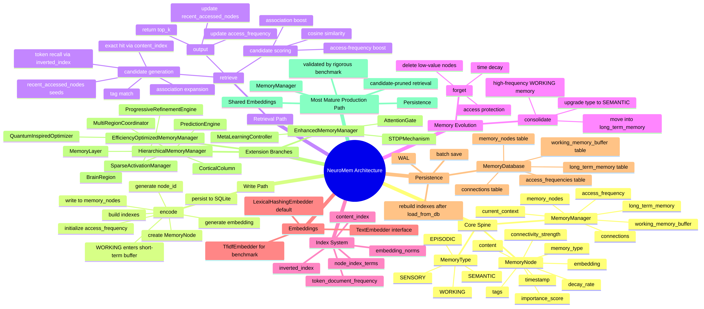
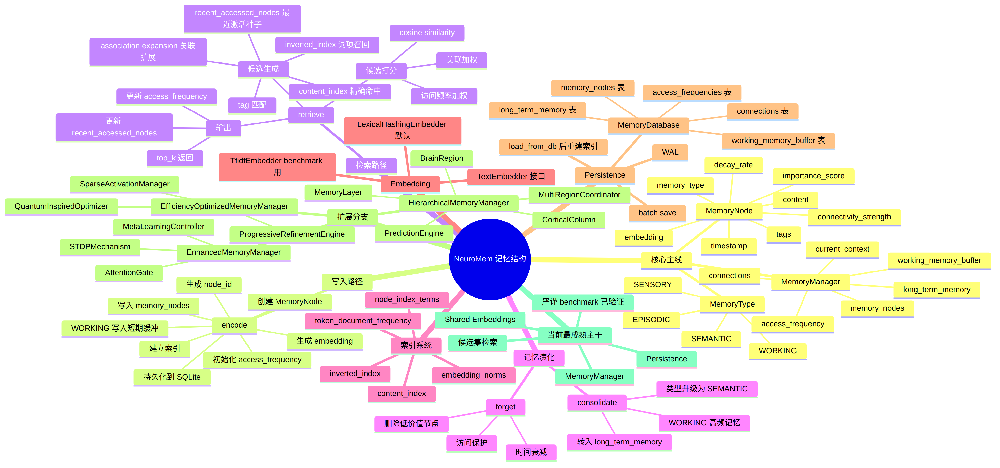

# NeuroMem-Agents: Neuromorphic Memory Management System

[](https://opensource.org/licenses/MIT)
[](https://www.python.org/downloads/)

A biologically-inspired memory management system for AI agents that mimics human memory architecture to improve contextual understanding and associative retrieval.

System architecture at a glance:




## Integration Compatibility

- **Upstream chat providers**: OpenAI, Anthropic, Gemini, Ollama, LM Studio, and vLLM
- **Client compatibility**: Python and JavaScript projects that already use an OpenAI-compatible `base_url`
- **MCP compatibility**: local `stdio` and remote `streamable-http` transports for IDE agents and MCP runtimes
- **API surface**: `/v1/chat/completions`, `/v1/responses`, `/v1/memory/records`, `/v1/memory/search`, `/v1/memory/stats`
- **Configuration model**: provider-agnostic JSON config with environment variable overrides
- **Examples**: `examples/configs/*.example.json` and `examples/compatibility/*`
- **MCP docs**: `docs/mcp_integration.md`
- **Roadmap**: `docs/compatibility_roadmap.md`

## 🧠 Key Features

- **Biological Inspiration**: Models human memory types (sensory, working, episodic, semantic)
- **Associative Networks**: Connections between related memories enable contextual recall
- **Spreading Activation**: Related memories are automatically activated during retrieval
- **Adaptive Forgetting**: Irrelevant memories are pruned to maintain efficiency
- **Contextual Tagging**: Rich metadata enables precise filtering and categorization
- **Persistent Storage**: Memory data is saved to and loaded from database for continuity
- **Memory Consolidation**: High-value memories are transferred from working to long-term storage

## 🧠 Advanced Neural Plasticity Features

- **STDP (Spike-Timing Dependent Plasticity)**: Connection strengths adjust based on activation timing, simulating biological long-term potentiation/depression
- **Meta-Learning**: System learns how to learn more effectively, dynamically adjusting parameters based on performance
- **Attention Gate**: Selective processing of relevant information, suppressing irrelevant memories during retrieval
- **Self-Adapting Architecture**: System continuously improves performance through biological-inspired mechanisms

## 🧠 Hierarchical Memory Architecture

- **Cortical Column Simulation**: Hierarchical processing units mimicking biological cortical columns with input, intermediate, output, and prediction layers
- **Multi-Region Coordination**: Coordination between different brain regions (hippocampus, prefrontal cortex, temporal lobe, etc.) for comprehensive information processing
- **Predictive Coding**: Prediction-based storage optimization that reduces unnecessary information storage by evaluating prediction error

## 🧠 Brain Region Coordination Mechanisms

- **Regional Activity Tracking**: Independent activity levels for each brain region with historical tracking
- **Inter-Regional Interactions**: Predefined connection strengths between brain regions with bidirectional communication
- **Coordination Algorithm**: Dynamic modulation of activity levels based on inter-regional influences
- **Multi-Region Retrieval**: Parallel access across multiple brain regions with weighted results
- **Biological Accuracy**: Mirrors real neural pathways and cross-regional information flow

## ⚡ Efficiency Optimizations

- **Sparse Activation**: Selective activation of relevant neural subsets, dramatically reducing computational costs
- **Progressive Refinement**: Coarse-grained filtering followed by fine-grained refinement process optimization
- **Quantum-Inspired Algorithms**: Quantum computing concepts applied to optimize search and association processes
- **Computational Savings**: Significant reduction in processing requirements while maintaining quality

## 🧠 Biological Design Details

Our system closely mimics human memory architecture:

### Hippocampus-Cortex Analogy
- **Working Memory Buffer**: Analogous to the hippocampus - high-speed but limited capacity storage for recent information
- **Long-term Memory**: Analogous to the cortex - vast storage capacity but slower access
- **Consolidation Process**: During idle periods (simulating sleep), frequently accessed memories in the working buffer are transferred to long-term storage

### Sleep-like Consolidation Mechanism
- **Idle State Detection**: The system identifies when it's not actively processing requests
- **Background Processing**: During idle periods, consolidates high-value memories from working to long-term storage
- **Frequency-based Selection**: Memories accessed more than a threshold (default: 3 times) are moved to long-term storage
- **Compression**: Information is processed and integrated during transfer to optimize long-term storage

### Memory Types and Their Biological Counterparts
- **Sensory Memory**: Mimics instantaneous sensory storage (milliseconds)
- **Working Memory**: Like the hippocampus, handles active processing with limited capacity
- **Episodic Memory**: Stores personal experiences and contextual events
- **Semantic Memory**: General knowledge and facts, like cortical storage

### Adaptive Forgetting
- **Decay Modeling**: Memories fade over time if not accessed
- **Importance Weighting**: Frequently accessed memories are retained longer
- **Resource Optimization**: Low-value memories are automatically pruned to maintain system efficiency

### Associative Networks
- **Synaptic Connections**: Memories are connected like neural pathways in the brain
- **Hebbian Learning**: "Cells that fire together, wire together" - connections strengthen with repeated activation
- **Spreading Activation**: When retrieving a memory, related memories are automatically activated

## 🚀 Quick Start

### Installation

```bash
pip install neuromem-agents
# or install the OpenAI-compatible proxy server
pip install 'neuromem-agents[server]'
# or install the MCP server
pip install 'neuromem-agents[mcp]'
```

### OpenAI-Compatible Proxy

Start from one of the example configs:

```bash
cp examples/configs/openai_proxy.example.json ./neuromem.proxy.json
export OPENAI_API_KEY=your_key_here
neuromem-openai-server --config ./neuromem.proxy.json
```

Then point any OpenAI-compatible client to the local proxy:

```bash
curl http://127.0.0.1:8080/v1/chat/completions \
  -H "Content-Type: application/json" \
  -H "Authorization: Bearer neuromem-local" \
  -d '{
    "model": "your-upstream-model",
    "messages": [
      {"role": "user", "content": "What did we decide about the retrieval pipeline?"}
    ],
    "neuromem": {
      "session_id": "demo-project",
      "top_k": 5,
      "store_messages": true
    }
  }'
```

You can also write or inspect memory directly:

```bash
curl http://127.0.0.1:8080/v1/memory/search \
  -H "Content-Type: application/json" \
  -d '{
    "query": "retrieval pipeline",
    "session_id": "demo-project",
    "top_k": 5
  }'
```

For SDK examples, see:

- `examples/compatibility/openai_sdk_client.py`
- `examples/compatibility/openai_sdk_responses_client.py`
- `examples/compatibility/openai_client.js`

### MCP Server

NeuroMem also ships with a first-party MCP server for IDE agents and MCP-capable runtimes.

Start a local `stdio` MCP server:

```bash
neuromem-mcp-server \
  --config examples/configs/mcp_stdio.example.json \
  --transport stdio
```

Start a remote `streamable-http` MCP server:

```bash
neuromem-mcp-server \
  --config examples/configs/mcp_streamable_http.example.json \
  --transport streamable-http \
  --host 127.0.0.1 \
  --port 8765
```

The default MCP HTTP endpoint is `http://127.0.0.1:8765/mcp`.

What it exposes:

- Tools: `create_memory`, `search_memory`, `list_memories`, `associate_memories`, `get_memory_stats`, `consolidate_memory`
- Resources: `memory://stats/overview`, `memory://sessions/{session_id}/summary`, `memory://records/{memory_id}`
- Prompts: `memory_recall_query`, `project_handoff_brief`

See `docs/mcp_integration.md` for VS Code and JetBrains setup examples.

### Basic Usage

```python
from neuromem.core import MemoryManager, EnhancedMemoryManager, HierarchicalMemoryManager, EfficiencyOptimizedMemoryManager, MemoryType

# Initialize the basic memory manager with persistence
mem_manager = MemoryManager(capacity=1000, db_path='my_memory.db')

# Or initialize the enhanced memory manager with neural plasticity
enhanced_manager = EnhancedMemoryManager(capacity=1000, db_path='my_enhanced_memory.db')

# Or initialize the hierarchical memory manager with full biological features
hier_manager = HierarchicalMemoryManager(capacity=1000, db_path='my_hierarchical_memory.db')

# Or initialize the efficiency-optimized memory manager
eff_manager = EfficiencyOptimizedMemoryManager(capacity=1000, db_path='my_efficient_memory.db')

# Encode information into memory
id1 = mem_manager.encode("The capital of France is Paris", MemoryType.SEMANTIC)
id2 = mem_manager.encode("I visited Paris last summer", MemoryType.EPISODIC)

# Create associations between memories
mem_manager.associate(id1, id2, strength=0.8)

# Retrieve related memories
results = mem_manager.retrieve("Paris", top_k=3)
for node in results:
    print(f"- {node.content}")

# Perform memory consolidation (like sleep/dreaming)
mem_manager.consolidate()

# Save to persistent storage
mem_manager.save_to_db()

# Get system statistics
stats = mem_manager.get_statistics()
print(stats)
```

### Efficiency-Optimized Usage

```python
from neuromem.core import EfficiencyOptimizedMemoryManager, MemoryType

# Initialize the efficiency-optimized memory manager
eff_manager = EfficiencyOptimizedMemoryManager(capacity=1000, db_path='efficient_memory.db')

# Encode information with sparse activation optimization
id1 = eff_manager.encode(
    "Quantum physics describes the behavior of matter and energy", 
    MemoryType.SEMANTIC,
    tags=["physics", "quantum"]
)

# Retrieve efficiently using sparse activation and progressive refinement
results = eff_manager.retrieve("quantum physics", top_k=3)
for node in results:
    print(f"- {node.content}")

# Get efficiency statistics
eff_stats = eff_manager.get_efficiency_statistics()
print(f"Efficiency: {eff_stats['activation_ratio']*100:.1f}% of nodes activated")

# The system automatically uses:
# - Sparse activation to minimize computational costs
# - Progressive refinement (coarse → fine) for optimization
# - Quantum-inspired algorithms for enhanced search
```

### Hierarchical Usage with Full Biological Features

```python
from neuromem.core import HierarchicalMemoryManager, MemoryType, BrainRegion, MemoryLayer

# Initialize the hierarchical memory manager with full biological features
hier_manager = HierarchicalMemoryManager(capacity=1000, db_path='hierarchical_memory.db')

# Encode information to specific brain regions and layers
hippocampus_id = hier_manager.encode(
    "The hippocampus is crucial for memory formation", 
    MemoryType.SEMANTIC, 
    BrainRegion.HIPPOCAMPUS,
    tags=["memory", "consolidation"],
    layer=MemoryLayer.INPUT_LAYER
)

prefrontal_id = hier_manager.encode(
    "Prefrontal cortex handles executive functions", 
    MemoryType.SEMANTIC, 
    BrainRegion.PREFRONTAL_CORTEX,
    tags=["decision", "planning"],
    layer=MemoryLayer.OUTPUT_LAYER
)

# Set up inter-regional interactions
hier_manager.coordinator.set_region_interaction(
    BrainRegion.HIPPOCAMPUS, 
    BrainRegion.PREFRONTAL_CORTEX, 
    0.8  # Strong interaction
)

# The system will automatically coordinate between regions and use predictive coding
# to optimize storage based on prediction error

# Use predictive retrieval for more contextually relevant results
results = hier_manager.predict_and_retrieve("memory formation", top_k=3)
for node in results:
    print(f"- [{node.region.value}] {node.content}")

# Coordinate retrieval across multiple brain regions
region_results = hier_manager.coordinate_regions(BrainRegion.HIPPOCAMPUS, "memory")
for region, nodes in region_results.items():
    if nodes:
        print(f"[{region.value}] {len(nodes)} related memories")
```

### Loading from Persistent Storage

```python
from neuromem.core import MemoryManager

# Create a new instance
restored_manager = MemoryManager(capacity=1000, db_path='my_memory.db')

# Load from persistent storage
restored_manager.load_from_db()

# Continue using the restored memory system
results = restored_manager.retrieve("Paris", top_k=3)
print(f"Retrieved {len(results)} memories from persistent storage")
```

### Comparison with Traditional RAG

```python
from neuromem.experiments import ComparisonEngine

# Run comparative analysis
engine = ComparisonEngine()
test_data = [
    {'content': 'Sample document content...', 'query': 'Sample query...'}
]
results = engine.run_comparison_test(test_data)
print(results['summary'])
```

### Rigorous Evaluation vs Traditional RAG

The repository now includes a reproducible benchmark that compares:

- `traditional_rag`
- `neuromem_in_memory`
- `neuromem_persistent`

Methodology for the latest benchmark:

- Shared `tfidf` embedding backend across all systems for a fair structural comparison
- `3` isolated trials per condition
- Corpus sizes: `128`, `512`, `1024`
- `64` measured queries and `16` warmup queries per trial
- Metrics include exact-match latency, topic-hit rate, and primed associative neighbor recall

Latest result files:

- `benchmark_results/rigorous_efficiency_benchmark_tfidf_optimized.json`
- `benchmark_results/rigorous_efficiency_benchmark_tfidf_optimized.md`

Key interpretation:

- All systems reached `exact top1 = 1.000` and `topic-hit@5 = 1.000`, so retrieval latency gains were not bought by collapsing accuracy.
- `neuromem_in_memory` is materially stronger than traditional RAG for larger memory pools. At corpus size `1024`, exact retrieval `p95` is `5.811 ms` versus `26.152 ms`.
- Associative retrieval remains a clear advantage. At corpus size `512`, primed neighbor recall is `0.854` for `neuromem_in_memory` versus `0.345` for traditional RAG.
- `neuromem_persistent` keeps most of the retrieval advantage, but pays a higher storage footprint because persistence is part of the feature set.

| Corpus Size | System | Build Time (s) | Exact p95 (ms) | Topic p95 (ms) | Neighbor Recall@5 |
| --- | --- | ---: | ---: | ---: | ---: |
| 128 | Traditional RAG | 0.127 | 3.813 | 3.707 | 0.850 |
| 128 | NeuroMem In-Memory | 0.147 | 3.714 | 3.655 | 1.000 |
| 128 | NeuroMem Persistent | 0.204 | 3.823 | 3.713 | 1.000 |
| 512 | Traditional RAG | 0.503 | 14.322 | 16.492 | 0.345 |
| 512 | NeuroMem In-Memory | 0.585 | 3.852 | 1.972 | 0.854 |
| 512 | NeuroMem Persistent | 0.825 | 3.905 | 2.779 | 0.854 |
| 1024 | Traditional RAG | 0.989 | 26.152 | 25.524 | 0.059 |
| 1024 | NeuroMem In-Memory | 1.186 | 5.811 | 1.904 | 0.132 |
| 1024 | NeuroMem Persistent | 1.715 | 7.964 | 2.069 | 0.132 |

Benchmark visualizations generated from the real JSON output:


### Running Experiments and Visualizations

The project includes comprehensive benchmarking tools:

- `benchmark_test.py`: Basic performance comparison
- `advanced_benchmark.py`: Complex scenario evaluation
- `extended_conversation_test.py`: 25+ interaction conversation simulation
- `neuromem/experiments/rigorous_benchmark.py`: Reproducible shared-embedding benchmark
- `visualize_results.py`: Generate charts from real benchmark JSON outputs

To run the latest rigorous benchmark and generate visualizations:

```bash
cd neuromem-agents
source venv/bin/activate  # if using virtual environment
pip install ".[benchmark,viz]"
python -m neuromem.experiments.rigorous_benchmark \
  --sizes 128 512 1024 \
  --trials 3 \
  --query-count 64 \
  --warmup-count 16 \
  --embedding-backend tfidf \
  --output benchmark_results/rigorous_efficiency_benchmark_tfidf_optimized.json
python visualize_results.py
```

Generated visualization files:
- `benchmark_results/rigorous_efficiency_benchmark_tfidf_optimized_absolute.png`: Absolute latency, build-time, and recall trends
- `benchmark_results/rigorous_efficiency_benchmark_tfidf_optimized_ratios.png`: NeuroMem vs traditional ratios
- `benchmark_results/rigorous_efficiency_benchmark_tfidf_optimized_footprint.png`: Heap and database footprint
- `benchmark_results/rigorous_efficiency_benchmark_tfidf_optimized_visualization_summary.txt`: Text summary for the generated charts

## 🏗️ Architecture

### Memory Types
- **Sensory Memory**: Instantaneous storage (milliseconds)
- **Working Memory**: Active processing (seconds to minutes) 
- **Episodic Memory**: Personal experiences and events
- **Semantic Memory**: General world knowledge

### Core Components
- `MemoryManager`: Main interface for memory operations with persistence
- `EnhancedMemoryManager`: Advanced manager with neural plasticity features
- `HierarchicalMemoryManager`: Full biological features with cortical columns, multi-region coordination, and predictive coding
- `EfficiencyOptimizedMemoryManager`: Efficiency-focused implementation with sparse activation, progressive refinement, and quantum-inspired algorithms
- `SpikingNeuralNetwork`: Neural dynamics simulation
- `MemoryNode`: Individual memory units with metadata
- `MemoryDatabase`: Persistent storage using SQLite
- `ComparisonEngine`: Benchmarking tools

## 📊 Performance Characteristics

Our current measured results show:
- Exact-match top-1 accuracy remains `1.000` across the latest rigorous benchmark.
- Topic-hit@5 remains `1.000`, so the benchmark improvements are not masking ranking collapse.
- `neuromem_in_memory` is substantially faster than traditional RAG at `512` and `1024` corpus sizes under a shared embedding backend.
- Associative recall remains stronger than traditional RAG, which is important for long conversations and large project contexts.
- Persistent NeuroMem keeps most of the retrieval advantage, while accepting a larger database footprint as a trade-off for continuity.

## 🤝 Contributing

We welcome contributions! Please see our [Contributing Guide](CONTRIBUTING.md) for details.

## 📄 License

This project is licensed under the MIT License - see the [LICENSE](LICENSE) file for details.

## 🙏 Acknowledgments

- Inspired by biological neural network research
- Built for the AI agent community

---

# NeuroMem-Agents：神经形态记忆管理系统

[](https://opensource.org/licenses/MIT)
[](https://www.python.org/downloads/)

一个生物学启发的AI代理记忆管理系统，模仿人类记忆架构以改善情境理解和关联检索。

系统结构总览：




## 兼容性与接入方式

- **上游聊天模型**：OpenAI、Anthropic、Gemini、Ollama、LM Studio、vLLM
- **客户端兼容性**：已支持 OpenAI-compatible `base_url` 的 Python / JavaScript / IDE / agent 工作流
- **MCP 兼容性**：支持本地 `stdio` 和远程 `streamable-http`，可接 IDE agent 与 MCP runtime
- **API 入口**：`/v1/chat/completions`、`/v1/responses`、`/v1/memory/records`、`/v1/memory/search`、`/v1/memory/stats`
- **配置方式**：统一 JSON 配置，加环境变量覆盖
- **示例目录**：`examples/configs/*.example.json` 与 `examples/compatibility/*`
- **MCP 文档**：`docs/mcp_integration.md`
- **路线图**：`docs/compatibility_roadmap.md`

## 🧠 主要特性

- **生物学启发**：建模人类记忆类型（感觉记忆、工作记忆、情节记忆、语义记忆）
- **关联网络**：相关记忆间的连接实现情境召回
- **扩散激活**：检索时自动激活相关记忆
- **自适应遗忘**：修剪不相关信息以保持效率
- **情境标记**：丰富的元数据实现精确过滤和分类
- **持久化存储**：记忆数据保存到数据库以保证连续性
- **记忆巩固**：高价值记忆从工作记忆转移到长期存储

## 🧠 高级神经可塑性特性

- **STDP（脉冲时间依赖可塑性）**：连接强度基于激活时间调整，模拟生物长时程增强/抑制
- **元学习**：系统学习如何更有效地学习，动态调整基于性能的参数
- **注意力门控**：相关息的选择性处理，检索时抑制无关记忆
- **自适应架构**：系统通过生物学启发机制持续改进性能

## 🧠 分层记忆架构

- **皮质柱模拟**：分层处理单元模仿生物皮质柱，具有输入、中间、输出和预测层
- **多区域协调**：不同脑区（海马体、前额叶、颞叶等）间的协调，实现综合信息处理
- **预测编码**：基于预测的存储优化，通过评估预测误差减少不必要的信息存储

## 🧠 脑区协调机制

- **区域活动跟踪**：每个脑区独立的活动水平，带有历史记录
- **区域间交互**：脑区间预定义的连接强度，具有双向通信
- **协调算法**：基于区域间影响的动态活动水平调节
- **多区域检索**：跨多个脑区的并行访问，加权结果
- **生物学准确性**：镜像真实脑区间的神经通路和跨区域信息流

## ⚡ 效率优化

- **稀疏激活**：选择性激活相关神经元子集，大幅降低计算成本
- **渐进式细化**：粗粒度筛选后进行细粒度精化的过程优化
- **量子启发算法**：利用量子计算概念优化搜索和关联过程
- **计算节省**：在保持质量的同时显著减少处理需求

## 🧠 类人脑设计细节

我们的系统紧密模仿人类记忆架构：

### 海马体-皮质类比
- **工作记忆缓冲区**：类似于海马体 - 高速但容量有限的近期信息存储
- **长期记忆**：类似于皮质 - 巨大存储容量但访问较慢
- **巩固过程**：在空闲期间（模拟睡眠），工作缓冲区中频繁访问的记忆被转移到长期存储

### 睡眠样巩固机制
- **空闲状态检测**：系统识别何时未积极处理请求
- **后台处理**：空闲期间，将高价值记忆从工作记忆转移到长期存储
- **频率选择**：访问次数超过阈值（默认：3次）的记忆被移动到长期存储
- **压缩**：传输过程中处理和整合信息以优化长期存储

### 记忆类型及其生物对应物
- **感觉记忆**：模仿瞬间感官存储（毫秒级）
- **工作记忆**：类似海马体，处理活跃任务，容量有限
- **情节记忆**：存储个人经历和情境事件
- **语义记忆**：一般知识和事实，类似皮质存储

### 自适应遗忘
- **衰减建模**：如果不访问，记忆会随时间消退
- **重要性加权**：频繁访问的记忆保留更久
- **资源优化**：自动修剪低价值记忆以保持系统效率

### 关联网络
- **突触连接**：记忆像大脑中的神经通路一样相互连接
- **赫布学习**："一起激发的细胞，一起连接" - 重复激活会加强连接
- **扩散激活**：检索记忆时，相关记忆会自动激活

## 🚀 快速开始

### 安装

```bash
pip install neuromem-agents
# 或安装 OpenAI-compatible 代理服务
pip install 'neuromem-agents[server]'
# 或安装 MCP 服务
pip install 'neuromem-agents[mcp]'
```

### OpenAI-Compatible 代理服务

先从示例配置开始：

```bash
cp examples/configs/openai_proxy.example.json ./neuromem.proxy.json
export OPENAI_API_KEY=your_key_here
neuromem-openai-server --config ./neuromem.proxy.json
```

然后把任意 OpenAI-compatible 客户端指向本地代理：

```bash
curl http://127.0.0.1:8080/v1/chat/completions \
  -H "Content-Type: application/json" \
  -H "Authorization: Bearer neuromem-local" \
  -d '{
    "model": "your-upstream-model",
    "messages": [
      {"role": "user", "content": "我们之前是怎么定检索链路的？"}
    ],
    "neuromem": {
      "session_id": "demo-project",
      "top_k": 5,
      "store_messages": true
    }
  }'
```

你也可以直接写入或检索记忆：

```bash
curl http://127.0.0.1:8080/v1/memory/search \
  -H "Content-Type: application/json" \
  -d '{
    "query": "检索链路",
    "session_id": "demo-project",
    "top_k": 5
  }'
```

SDK 示例见：

- `examples/compatibility/openai_sdk_client.py`
- `examples/compatibility/openai_sdk_responses_client.py`
- `examples/compatibility/openai_client.js`

### MCP 服务

NeuroMem 也提供了一等支持的 MCP server，适合 IDE agent 和支持 MCP 的运行时。

启动本地 `stdio` MCP 服务：

```bash
neuromem-mcp-server \
  --config examples/configs/mcp_stdio.example.json \
  --transport stdio
```

启动远程 `streamable-http` MCP 服务：

```bash
neuromem-mcp-server \
  --config examples/configs/mcp_streamable_http.example.json \
  --transport streamable-http \
  --host 127.0.0.1 \
  --port 8765
```

默认 MCP HTTP 端点为 `http://127.0.0.1:8765/mcp`。

它暴露的能力包括：

- Tools：`create_memory`、`search_memory`、`list_memories`、`associate_memories`、`get_memory_stats`、`consolidate_memory`
- Resources：`memory://stats/overview`、`memory://sessions/{session_id}/summary`、`memory://records/{memory_id}`
- Prompts：`memory_recall_query`、`project_handoff_brief`

VS Code 和 JetBrains 的接入示例见 `docs/mcp_integration.md`。

### 基础使用

```python
from neuromem.core import MemoryManager, EnhancedMemoryManager, HierarchicalMemoryManager, EfficiencyOptimizedMemoryManager, MemoryType

# 初始化带持久化的基础记忆管理器
mem_manager = MemoryManager(capacity=1000, db_path='my_memory.db')

# 或初始化带神经可塑性的增强记忆管理器
enhanced_manager = EnhancedMemoryManager(capacity=1000, db_path='my_enhanced_memory.db')

# 或初始化带完整生物特性的分层记忆管理器
hier_manager = HierarchicalMemoryManager(capacity=1000, db_path='my_hierarchical_memory.db')

# 或初始化效率优化的记忆管理器
eff_manager = EfficiencyOptimizedMemoryManager(capacity=1000, db_path='my_efficient_memory.db')

# 编码信息到记忆中
id1 = mem_manager.encode("法国的首都是巴黎", MemoryType.SEMANTIC)
id2 = mem_manager.encode("我去年夏天参观了巴黎", MemoryType.EPISODIC)

# 在记忆间创建关联
mem_manager.associate(id1, id2, strength=0.8)

# 检索相关记忆
results = mem_manager.retrieve("巴黎", top_k=3)
for node in results:
    print(f"- {node.content}")

# 执行记忆巩固（类似睡眠/梦境）
mem_manager.consolidate()

# 保存到持久化存储
mem_manager.save_to_db()

# 获取系统统计信息
stats = mem_manager.get_statistics()
print(stats)
```

### 效率优化使用

```python
from neuromem.core import EfficiencyOptimizedMemoryManager, MemoryType

# 初始化效率优化的记忆管理器
eff_manager = EfficiencyOptimizedMemoryManager(capacity=1000, db_path='efficient_memory.db')

# 使用稀疏激活优化编码信息
id1 = eff_manager.encode(
    "量子物理描述物质和能量的行为", 
    MemoryType.SEMANTIC,
    tags=["物理", "量子"]
)

# 使用稀疏激活和渐进式细化高效检索
results = eff_manager.retrieve("量子物理", top_k=3)
for node in results:
    print(f"- {node.content}")

# 获取效率统计
eff_stats = eff_manager.get_efficiency_statistics()
print(f"效率: {eff_stats['activation_ratio']*100:.1f}% 的节点被激活")

# 系统自动使用:
# - 稀疏激活以最小化计算成本
# - 渐进式细化（粗→精）优化
# - 量子启发算法增强搜索
```

### 带完整生物特性的分层使用

```python
from neuromem.core import HierarchicalMemoryManager, MemoryType, BrainRegion, MemoryLayer

# 初始化带完整生物特性的分层记忆管理器
hier_manager = HierarchicalMemoryManager(capacity=1000, db_path='hierarchical_memory.db')

# 编码信息到特定脑区和层
hippocampus_id = hier_manager.encode(
    "海马体对记忆形成至关重要", 
    MemoryType.SEMANTIC, 
    BrainRegion.HIPPOCAMPUS,
    tags=["记忆", "巩固"],
    layer=MemoryLayer.INPUT_LAYER
)

prefrontal_id = hier_manager.encode(
    "前额叶皮质处理执行功能", 
    MemoryType.SEMANTIC, 
    BrainRegion.PREFRONTAL_CORTEX,
    tags=["决策", "规划"],
    layer=MemoryLayer.OUTPUT_LAYER
)

# 设置区域间交互
hier_manager.coordinator.set_region_interaction(
    BrainRegion.HIPPOCAMPUS, 
    BrainRegion.PREFRONTAL_CORTEX, 
    0.8  # 强交互
)

# 系统将自动在区域间协调，并使用预测编码
# 基于预测误差优化存储

# 使用预测检索获得更符合情境的结果
results = hier_manager.predict_and_retrieve("记忆形成", top_k=3)
for node in results:
    print(f"- [{node.region.value}] {node.content}")

# 跨多个脑区协调检索
region_results = hier_manager.coordinate_regions(BrainRegion.HIPPOCAMPUS, "记忆")
for region, nodes in region_results.items():
    if nodes:
        print(f"[{region.value}] {len(nodes)} 相关记忆")
```

### 从持久化存储加载

```python
from neuromem.core import MemoryManager

# 创建新实例
restored_manager = MemoryManager(capacity=1000, db_path='my_memory.db')

# 从持久化存储加载
restored_manager.load_from_db()

# 继续使用恢复的记忆系统
results = restored_manager.retrieve("巴黎", top_k=3)
print(f"从持久化存储检索到 {len(results)} 个记忆")
```

### 与传统RAG的对比

```python
from neuromem.experiments import ComparisonEngine

# 运行对比分析
engine = ComparisonEngine()
test_data = [
    {'content': '示例文档内容...', 'query': '示例查询...'}
]
results = engine.run_comparison_test(test_data)
print(results['summary'])
```

### 严谨基准测试结果

仓库现在包含一套可复现的严谨 benchmark，对比以下三种系统：

- `traditional_rag`
- `neuromem_in_memory`
- `neuromem_persistent`

最新测试的方法学设置：

- 所有系统统一使用共享 `tfidf` embedding backend，保证对比聚焦在记忆结构而不是 embedding 偏差
- 每个条件运行 `3` 次隔离试验
- 语料规模为 `128`、`512`、`1024`
- 每次试验包含 `64` 个正式查询和 `16` 个 warmup 查询
- 指标包括 exact-match 延迟、topic-hit rate 和 primed associative neighbor recall

最新结果文件：

- `benchmark_results/rigorous_efficiency_benchmark_tfidf_optimized.json`
- `benchmark_results/rigorous_efficiency_benchmark_tfidf_optimized.md`

结论可以概括为：

- 所有系统都达到 `exact top1 = 1.000` 和 `topic-hit@5 = 1.000`，说明速度提升不是靠牺牲正确性换来的。
- 在更接近长对话和大项目的记忆规模下，`neuromem_in_memory` 明显优于传统 RAG。语料规模 `1024` 时，exact retrieval `p95` 为 `5.811 ms`，传统 RAG 为 `26.152 ms`。
- 关联检索依然是主要优势。语料规模 `512` 时，primed neighbor recall 为 `0.854`，传统 RAG 仅为 `0.345`。
- `neuromem_persistent` 保留了大部分检索优势，但由于持久化本身就是特性的一部分，因此会带来更大的存储开销。

| 语料规模 | 系统 | 构建时间 (s) | Exact p95 (ms) | Topic p95 (ms) | Neighbor Recall@5 |
| --- | --- | ---: | ---: | ---: | ---: |
| 128 | Traditional RAG | 0.127 | 3.813 | 3.707 | 0.850 |
| 128 | NeuroMem In-Memory | 0.147 | 3.714 | 3.655 | 1.000 |
| 128 | NeuroMem Persistent | 0.204 | 3.823 | 3.713 | 1.000 |
| 512 | Traditional RAG | 0.503 | 14.322 | 16.492 | 0.345 |
| 512 | NeuroMem In-Memory | 0.585 | 3.852 | 1.972 | 0.854 |
| 512 | NeuroMem Persistent | 0.825 | 3.905 | 2.779 | 0.854 |
| 1024 | Traditional RAG | 0.989 | 26.152 | 25.524 | 0.059 |
| 1024 | NeuroMem In-Memory | 1.186 | 5.811 | 1.904 | 0.132 |
| 1024 | NeuroMem Persistent | 1.715 | 7.964 | 2.069 | 0.132 |

以下图示均直接由真实 benchmark JSON 生成：


### 运行实验和可视化

项目包含全面的基准测试工具：

- `benchmark_test.py`: 基础性能对比
- `advanced_benchmark.py`: 复杂场景评估
- `extended_conversation_test.py`: 25+次交互对话模拟
- `neuromem/experiments/rigorous_benchmark.py`: 可复现的共享 embedding benchmark
- `visualize_results.py`: 从真实 benchmark JSON 生成图表

运行最新严谨 benchmark 并生成可视化：

```bash
cd neuromem-agents
source venv/bin/activate  # 如果使用虚拟环境
pip install ".[benchmark,viz]"
python -m neuromem.experiments.rigorous_benchmark \
  --sizes 128 512 1024 \
  --trials 3 \
  --query-count 64 \
  --warmup-count 16 \
  --embedding-backend tfidf \
  --output benchmark_results/rigorous_efficiency_benchmark_tfidf_optimized.json
python visualize_results.py
```

生成的可视化文件：
- `benchmark_results/rigorous_efficiency_benchmark_tfidf_optimized_absolute.png`: 绝对延迟、构建时间和 recall 趋势图
- `benchmark_results/rigorous_efficiency_benchmark_tfidf_optimized_ratios.png`: NeuroMem 相对传统 RAG 的比例图
- `benchmark_results/rigorous_efficiency_benchmark_tfidf_optimized_footprint.png`: Heap 和数据库占用图
- `benchmark_results/rigorous_efficiency_benchmark_tfidf_optimized_visualization_summary.txt`: 图表文字摘要

## 🏗️ 架构

### 记忆类型
- **感觉记忆**：即时存储（毫秒级）
- **工作记忆**：主动处理（秒到分钟级）
- **情节记忆**：个人经验和事件
- **语义记忆**：一般世界知识

### 核心组件
- `MemoryManager`: 记忆操作的主接口（含持久化）
- `EnhancedMemoryManager`: 带神经可塑性的高级管理器
- `HierarchicalMemoryManager`: 带皮质柱、多区域协调和预测编码的完整生物特性管理器
- `EfficiencyOptimizedMemoryManager`: 效率专注的实现，包含稀疏激活、渐进式细化和量子启发算法
- `SpikingNeuralNetwork`: 神经动力学模拟
- `MemoryNode`: 带元数据的单个记忆单元
- `MemoryDatabase`: 使用SQLite的持久化存储
- `ComparisonEngine`: 基准测试工具

## 📊 性能特征

当前实测结果表明：
- 最新严谨 benchmark 中，exact-match top-1 accuracy 始终保持 `1.000`。
- Topic-hit@5 始终保持 `1.000`，说明性能提升没有掩盖排序退化。
- 在共享 embedding backend 条件下，`neuromem_in_memory` 在 `512` 和 `1024` 规模上明显快于传统 RAG。
- 关联召回仍显著强于传统 RAG，这一点对长对话和大项目上下文尤其重要。
- 持久化 NeuroMem 保留了大部分检索优势，但以更大的数据库体积作为连续性的代价。

## 🤝 贡献

欢迎贡献！详情请参见我们的[贡献指南](CONTRIBUTING.md)。

## 📄 许可证

该项目基于MIT许可证 - 详见[LICENSE](LICENSE)文件。

## 🙏 致谢

- 受生物神经网络研究启发
- 为AI代理社区构建
