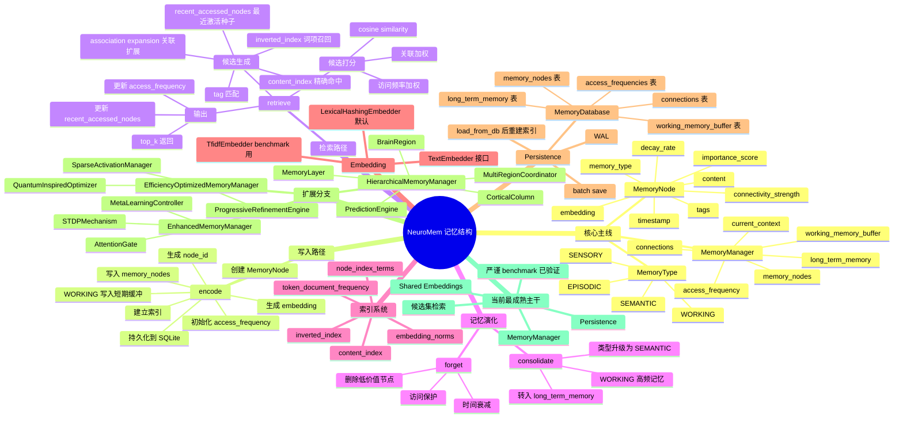
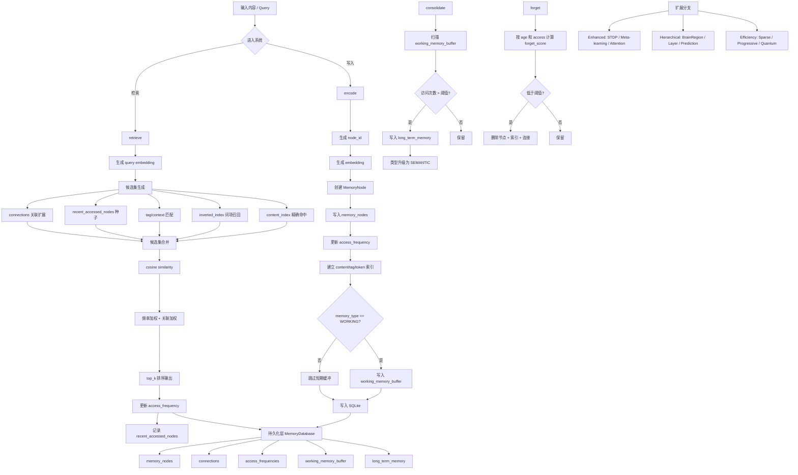

# NeuroMem 架构思维导图

这个文件包含两种 Mermaid 图：

- `mindmap`：适合快速回忆整体设计
- `flowchart`：适合看写入、检索、巩固、遗忘的主流程

如果你的 Markdown 预览器不支持 `mindmap`，可以直接看下面的 `flowchart`，或者把代码粘到 Mermaid Live Editor。

## 1. 思维导图

## 2. 结构流转图

## 3. 一句话理解

NeuroMem 不是“纯向量库检索”，而是：

**分类型记忆节点 + 关联图 + 短期/长期记忆分层 + 访问驱动巩固与遗忘 + 上下文扩散检索**
