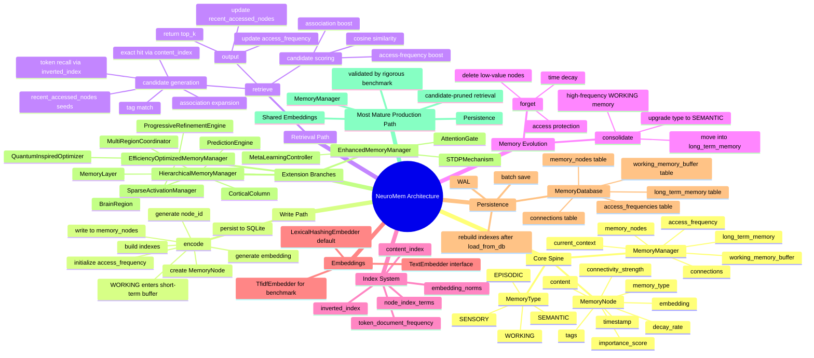
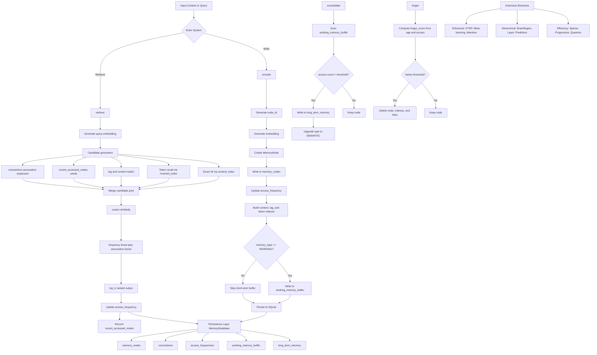

# NeuroMem Architecture Diagrams

This file contains two Mermaid diagrams:

- `mindmap`: a compact overview of the system design
- `flowchart`: the main write, retrieve, consolidate, and forget flows

If your Markdown renderer does not support `mindmap`, use the `flowchart` below or paste the code into Mermaid Live Editor.

## 1. Mindmap

## 2. Flowchart

## 3. One-line Summary

NeuroMem is not just a vector store. It is:

**typed memory nodes + an associative graph + short-term and long-term layering + access-driven consolidation and forgetting + context-expanding retrieval**

